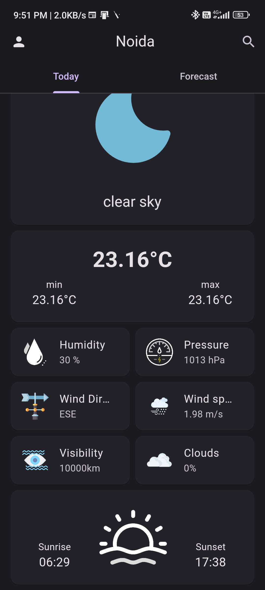
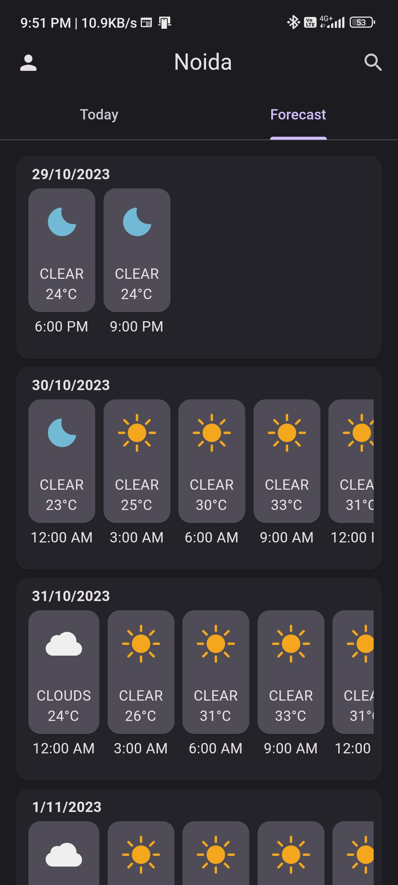
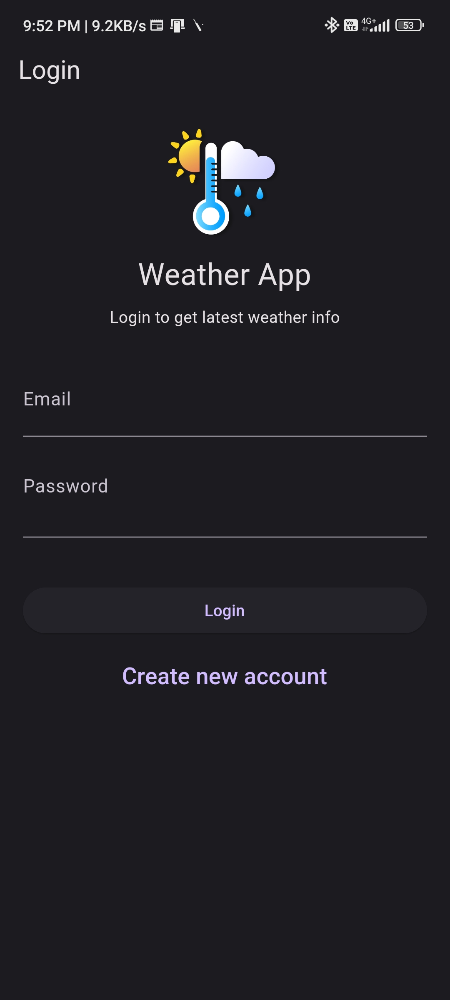
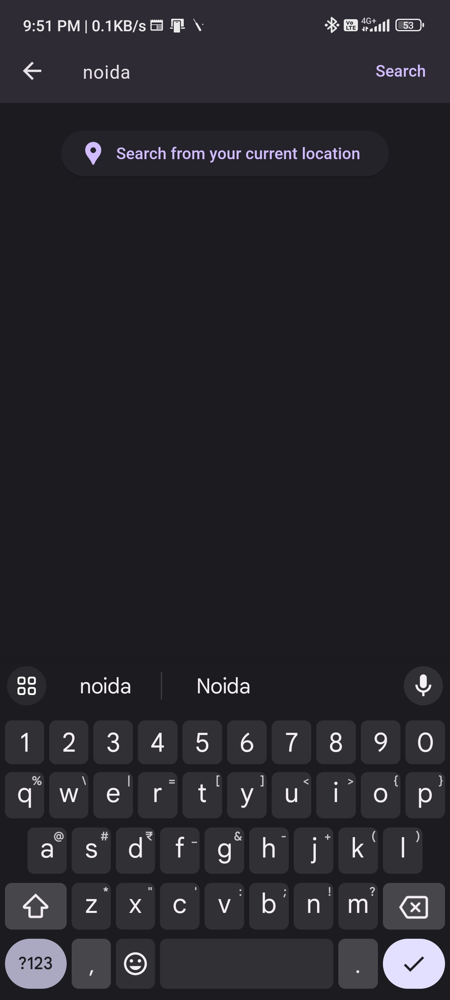
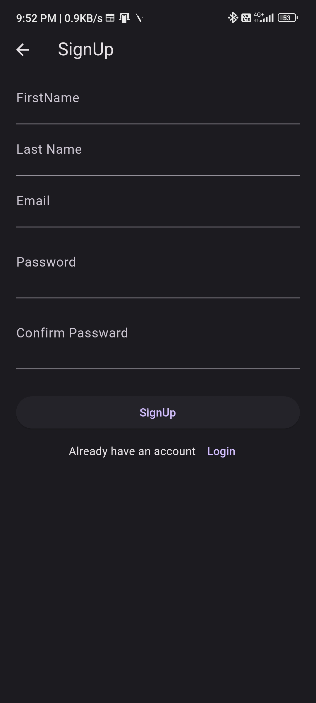
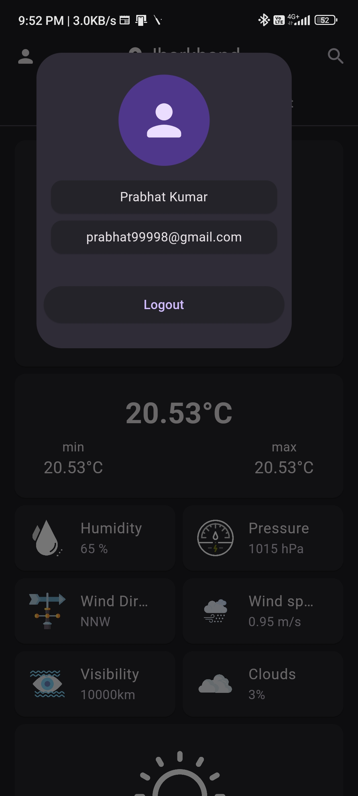

# Mausam

A weather app built using flutter and openWeatherMap api

## Features
- Top-Notch Error handling
- Firebase login
- Bloc Pattern
- Clean Architecture
- Daily weather details
- Weather forecast for 5 days

## How to setup
- To use this project get your api key from openWeatherMap
- Rename the `.env.example` from the project's root directory to `.env`
- Now paste your apiKey inside `.env`
```
api_key=[ADD YOUR OWN OPENWEATHERMAP API KEY FROM https://home.openweathermap.org/api_keys]
```
- You should also setUp firebase with your own credentials

Congrats you have completed the setup now you can run the project.


## ScreenShots








## Project Structure
```
lib
├───core
│   ├───config
│   ├───constants
│   └───utils
├───domain
│   ├───exceptions
│   └───bloc
│       ├───auth_bloc
│       ├───weather_bloc
│       └───forecast_bloc
├───presentation
│   ├───screens
│   │   ├───current_weather
│   │   │   └───components
│   │   ├───forecast
│   │   │   └───components
│   │   ├───authentication
│   │   │   └───components
│   │   ├───splash
│   │   ├───homescreen
│   │   │   └───components
│   │   └───search
│   └───widgets
└───data
    ├───models
    └───repositories
        ├───auth_repository
        ├───user_repository
        └───weather_repository
```

